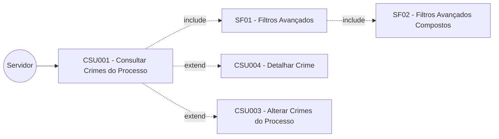
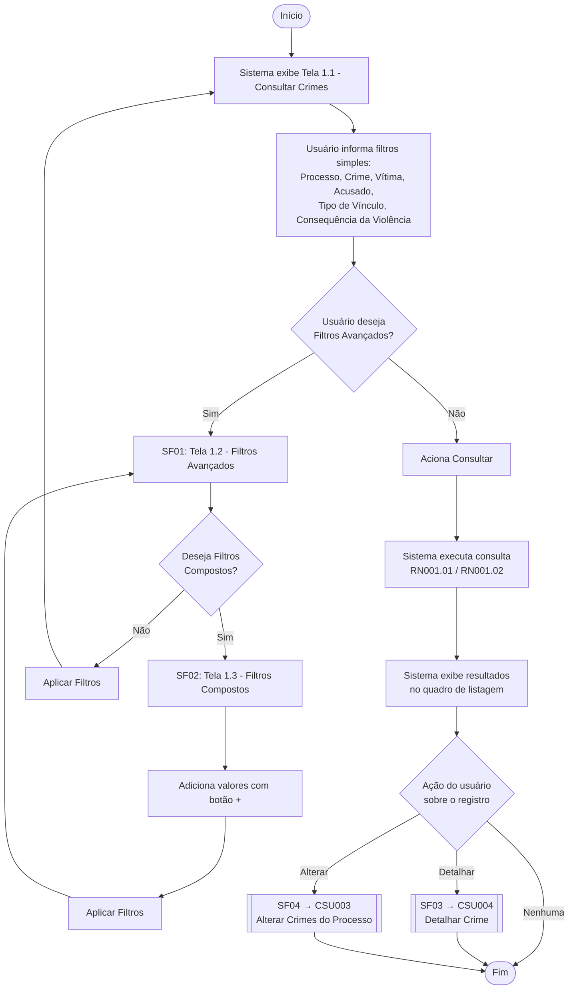

# CSU001 – Consultar Crimes do Processo

**Sistema:** SCELUS
**Local:** São Luís
**Última atualização:** 02/06/2026 — v1.0 — Olavo Abreu

---

## 1. Descrição

Permite ao usuário consultar os crimes do processo cadastrados no sistema Scelus, por meio de **filtros simples**, **filtros avançados** e **filtros avançados compostos**.

A consulta pode ser feita com base em atributos do processo, do fato ocorrido, da vítima, do acusado, dos vínculos entre as partes, das consequências da violência e das Medidas Protetivas de Urgência (MPU).

Também permite:
- Visualizar registros localizados;
- Acessar a alteração de registros;
- Iniciar novo cadastro de crimes do processo.

## 2. Atores

| Ator | Responsabilidade |
|---|---|
| Servidor | Consulta os crimes associados ao processo |

## 3. Diagrama de caso de uso

> Arquivo original: `\documentos\REQ\Diagramas\Caso de uso\diagrama_casos_uso.jpg`

## 4. Pré-condições

- Usuário autenticado;
- Usuário com permissão de consulta;
- Existência de dados cadastrados.

## 5. Fluxo principal e subfluxos

1. O usuário acessa a funcionalidade;
2. O sistema exibe a tela **Consultar Crimes do Processo** (Tela 1.1);
3. O usuário informa um ou mais filtros simples: Processo, Crime, Vítima, Acusado, Tipo de vínculo, Consequência da violência;
4. O usuário aciona **\<Consultar\>**;
5. O sistema executa a consulta (RN001.01, RN001.02);
6. O sistema exibe os resultados no quadro de listagem, com opções de visualizar ou alterar os registros;
7. Fluxo encerrado.

### SF01 – Utilizar Filtros Avançados
1. O usuário aciona **\<Filtros Avançados\>**;
2. O sistema exibe a tela **Filtros Avançados** (Tela 1.2);
3. O usuário informa valores para Nome, Ocupação, Deficiência, Estado Civil, Religião, Escolaridade e Renda (blocos Vítima e Acusado), além de Data da Decisão, Legislação, Concessão, Datas de Intimação/Ciência do Acusado e da Vítima e pedido de desistência (bloco MPU);
4. O usuário aciona **\<Aplicar Filtros\>**;
5. O sistema retorna à Tela 1.1 com os filtros carregados;
6. Fluxo principal retomado.

### SF02 – Utilizar Filtros Avançados Compostos
1. Na tela de Filtros Avançados, o usuário aciona **\<Filtros Avançados Compostos\>**;
2. O sistema exibe a tela **Filtros Compostos** (Tela 1.3);
3. O usuário pode adicionar múltiplos valores para: Drogas utilizadas, Ocupação, Deficiência, Raça/Etnia, Benefícios e Consequências da violência (blocos Acusado e Vítima);
4. O usuário utiliza o botão **(+)** para incluir valores nos quadros resumo;
5. O sistema exibe dinamicamente os valores selecionados;
6. O usuário aciona **\<Aplicar Filtros\>**;
7. O sistema retorna à tela anterior mantendo os filtros compostos;
8. SF01 é retomado.

### SF03 – Detalhar Crime
1. O usuário aciona **\<Detalhar\>**;
2. O sistema direciona para **CSU004 – Detalhar Crime**.

### SF04 – Alterar Crime
1. O usuário aciona **\<Alterar\>**;
2. O sistema direciona para **CSU003 – Alterar Crimes do Processo**.

### Diagrama de fluxo (visão geral)

## 6. Fluxos alternativos

Não se aplica.

## 7. Fluxos de exceção

Não se aplica.

## 8. Regras de negócio

| Código | Regra |
|---|---|
| RN001.01 | Os filtros são aplicados cumulativamente (**AND**). |
| RN001.02 | Em um mesmo filtro composto, os filtros são aplicados não cumulativamente (**OR**). |

## 9. Requisitos especiais

Não se aplica.

## 10. Pós-condição

Consulta de crimes realizada com sucesso.

## 11. Observações

O sistema Scelus deve seguir o padrão de interface adotado no sistema "Novo Gestor", assim como comportamentos padrão em todos os sistemas do TJMA.

## 12. Interface de usuário

### Tela 1.1 – Consultar Crimes

| Nome | Atributo |
|---|---|
| Processo | VW_PROCESSO.str_numero_unico |
| Crime | VW_CRIME.str_descricao_assunto |
| Vítima | VW_PARTE.str_nome |
| Acusado | VW_PARTE.str_nome |
| Tipo de Vínculo | TB_TIPO_VINCULO.str_tipo_vinculo |
| Consequência da Violência | TB_TIPO_CONSEQUENCIA_VIOLENCIA.str_tipo_consequencia_violencia |
| MPU | "S" se existir registro em TB_FATO_OCORRIDO_MPU para o fato; "N" caso contrário |
| Deficiência da Vítima | TB_DEFICIENCIA.str_deficiencia |

### Tela 1.2 – Filtros Avançados

| Nome | Atributo | Restrição |
|---|---|---|
| Nome | VW_PARTE.str_nome | Observar vínculo com TB_LITIGANCIA/TB_ACUSADO/TB_VITIMA |
| Ocupação | TB_OCUPACAO.str_ocupacao | idem |
| Deficiência | TB_DEFICIENCIA.str_deficiencia | idem |
| Estado Civil | TB_ESTADO_CIVIL.str_estado_civil | idem |
| Religião | TB_RELIGIAO.str_religiao | idem |
| Escolaridade | TB_ESCOLARIDADE.str_escolaridade | idem |
| Renda | TB_RENDA.str_renda | idem |
| Data da Decisão | TB_MEDIDA_PROTETIVA_URGENCIA.dta_decisao | — |
| Legislação | TB_MEDIDA_PROTETIVA_URGENCIA.str_legislacao_fundamento | — |
| Foi Concedida? | TB_MEDIDA_PROTETIVA_URGENCIA.bol_concedida | — |
| Data de Intimação do Acusado | TB_MEDIDA_PROTETIVA_URGENCIA.dta_intimacao_acusado | — |
| Data de Intimação da Vítima | TB_MEDIDA_PROTETIVA_URGENCIA.dta_intimacao_vitima | — |
| Data de Ciência do Acusado | TB_MEDIDA_PROTETIVA_URGENCIA.dta_ciencia_acusado | — |
| Data de Ciência da Vítima | TB_MEDIDA_PROTETIVA_URGENCIA.dta_ciencia_vitima | — |
| Há pedido de desistência? | TB_MEDIDA_PROTETIVA_URGENCIA.bol_pedido_desistencia | — |

### Tela 1.3 – Filtros Avançados Compostos

| Nome | Atributo | Restrição |
|---|---|---|
| Drogas Utilizadas | TB_DROGA.str_droga | Observar vínculo com TB_LITIGANCIA/TB_ACUSADO/TB_VITIMA |
| Ocupação | TB_OCUPACAO.str_ocupacao | idem |
| Deficiência | TB_DEFICIENCIA.str_deficiencia | idem |
| Raça/Etnia | TB_RACA_ETNIA.str_raca_etnia | idem |
| Benefício | TB_TIPO_BENEFICIO.str_tipo_beneficio | idem |
| Consequência da Violência | TB_TIPO_CONSEQUENCIA_VIOLENCIA.str_tipo_consequencia_violencia | — |

**Observação:** os campos devem ser bloqueados para digitação ao atingir a capacidade máxima definida.

## 13. Diagrama de atividade

Não se aplica.

## 14. Diagrama de estado

Não se aplica.

## 15. Diagrama entidade-relacionamento (DER)

> `\documentos\REQ\Diagramas\DER`

---

## ⚠️ Pontos de atenção para o desenvolvimento

- A tela 1.1 lista **7 filtros simples**, mas a tabela de UI descreve **8 linhas** (inclui "Deficiência da Vítima" fora do texto do fluxo principal) — validar com o time se este campo deve aparecer na Tela 1.1 ou se pertence à Tela 1.2.
- RN001.01/RN001.02 definem semântica **AND** entre filtros simples/avançados e **OR** dentro de um mesmo filtro composto — importante para a construção da query dinâmica.
- O campo "MPU" na Tela 1.1 é calculado (S/N), não um atributo direto — precisa de subquery/EXISTS em TB_FATO_OCORRIDO_MPU.
- SF03 e SF04 são navegações para outros casos de uso (CSU004 e CSU003) — não há retorno automático definido; validar se a navegação preserva o contexto/filtros da consulta.
