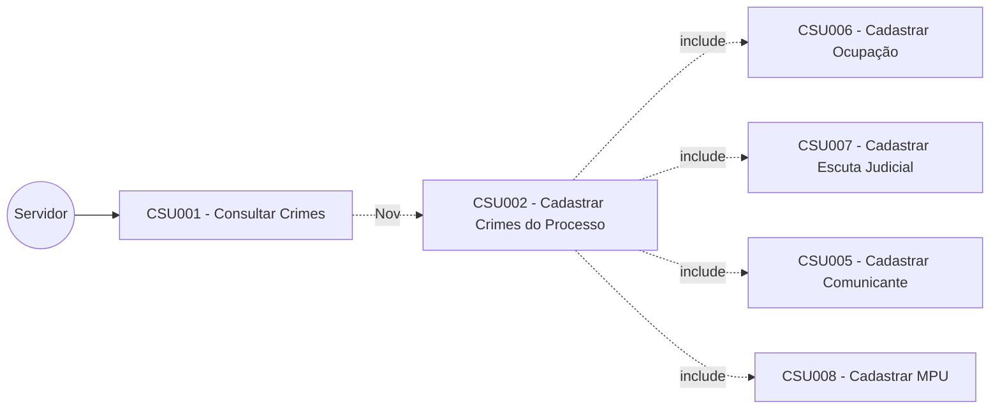
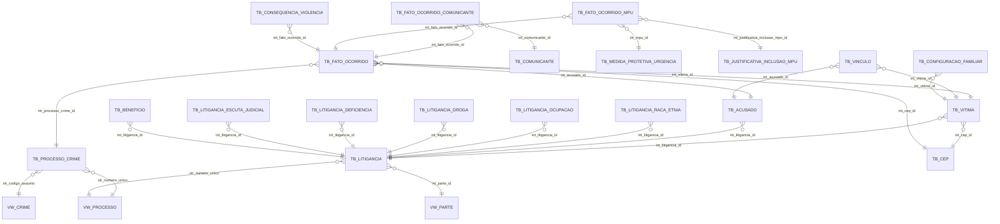
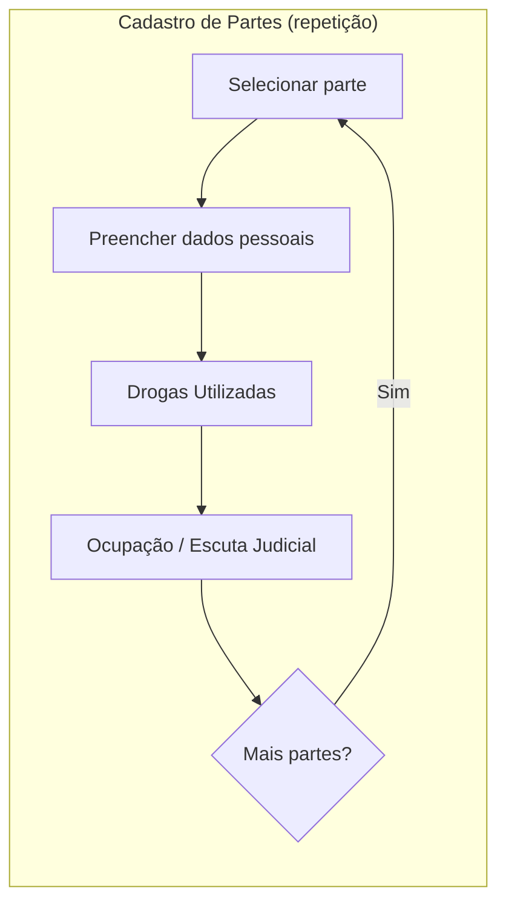

# CSU002 – Cadastrar Crimes do Processo

**Sistema:** SCELUS
**Local:** São Luís
**Última atualização:** 22/05/2025 — v1.0 — Olavo Abreu
> Nota: a aprovação do documento cita o projeto "PERITUS" — provável resíduo de template; confirmar se o nome do projeto está correto.

---

## 1. Descrição

Permite ao usuário cadastrar os crimes associados a um processo judicial, incluindo dados do processo, das partes (vítimas e acusados), vínculos entre elas, fatos ocorridos, benefícios, configuração familiar, Medidas Protetivas de Urgência (MPU) e consequências da violência.

## 2. Atores

| Ator | Responsabilidade |
|---|---|
| Servidor | Realiza os passos do cadastro dos crimes associados ao processo |

## 3. Diagrama de caso de uso

> Arquivo original: `\documentos\REQ\Diagramas\Caso de uso\diagrama_casos_uso.jpg`

## 4. Pré-condições

- O PJE deve estar acessível;
- O usuário acessa a tela **Consultar Crimes** (CSU001 – Tela 1.1) e aciona **\<Novo\>**.

## 5. Fluxo principal (resumo por etapas)

| # | Etapa | Tela |
|---|---|---|
| 1 | Selecionar Processo (consulta ao PJE) | 2.1 |
| 2 | Cadastrar Crimes Cometidos | 2.2 |
| 3 | Associar Parte a Benefício | 2.3 |
| 4 | Associar Parte à Configuração Familiar | 2.4 |
| 5 | Cadastrar Vítimas (1 ou mais) | 2.5 |
| 6 | Cadastrar Acusados (1 ou mais) | 2.6 |
| 7 | Cadastrar Vínculos Acusado/Vítima | 2.7 |
| 8 | Cadastrar Fatos Ocorridos (+ MPU opcional) | 2.8 → CSU008 |
| 9 | Cadastrar Consequência da Violência (opcional) | 2.9 |
| 10 | Finalizar (persistência definitiva) | — |

### Detalhamento

1. O sistema exibe a tela **Selecionar Processo** (Tela 2.1), com o campo "possui sentença" desativado;
2. O usuário informa o número do processo e consulta;
3. O sistema busca na base do PJE, retorna dados do processo e das partes, preenche a tela e ativa o campo "possui sentença";
4. O usuário informa se o processo possui sentença;
5. O usuário aciona **\<Cadastrar Crimes Cometidos\>**;
6. O sistema exibe a Tela 2.2, preenchida com processo e partes;
7. Com base nos assuntos do processo, o sistema preenche os tipos de crime e violência associados;
8. O usuário aciona **\<Associar Parte Benefício\>** → Tela 2.3; associa Parte + Benefício + Data Início via **\<associar\>**; quadro resumo atualizado dinamicamente;
9. O usuário aciona **\<Associar Parte Configuração Familiar\>** → Tela 2.4; associa Parte + Configuração Familiar + Data de declaração + Observações via **\<associar\>**; quadro resumo atualizado;
10. O usuário aciona **\<Cadastrar Vítimas\>** → Tela 2.5. Para cada vítima (polo ativo): Gênero, Raça/Etnia, Estado Civil, Religião, Escolaridade, Ano/Série, Escola Pública, Posição na Prole (+observações), Drogas Utilizadas (obrigatório indicar "não usuária"/"não especificado" quando não houver), Data de Nascimento (carregada), Nome Social, CEP, Ocupação (facultado cadastrar nova via **CSU006**), Escutas Judiciais (via **CSU007**, uma por vez). Repetir com **\<Outra Vítima\>** ou avançar com **\<Cadastrar Acusados\>**;
11. O sistema exibe Tela 2.6. Para cada acusado (polo passivo): mesmos dados de perfil + Drogas Utilizadas + Ocupação (**CSU006**) + Escuta Judicial (**CSU007**) + Antecedentes + Reincidência. Repetir com **\<Outro Acusado\>** ou avançar com **\<Cadastrar Vínculos\>**;
12. O sistema exibe Tela 2.7; o usuário associa Vítima + Acusado + Tipo de Vínculo + Observações via **\<Associar\>**; quadro resumo atualizado;
13. O usuário aciona **\<Cadastrar Fatos Ocorridos\>** → Tela 2.8; associa Crime + Vítima + Acusado + CEP do fato + Comunicante (+Tipo, facultado cadastrar via **CSU005**) via **\<Associar\>**; quadro resumo atualizado;
14. Se houver MPU associada ao par Acusado-Vítima do fato, o usuário pode acionar **\<Cadastrar MPU\>** (**CSU008**);
15. Se não houver consequências da violência, aciona **\<Finalizar\>**; caso contrário, aciona **\<Cadastrar Consequência da Violência\>** → Tela 2.9; seleciona Fato Ocorrido + Tipo de Consequência + Observações via **\<Associar\>**; quadro resumo atualizado;
16. O usuário aciona **\<Finalizar\>** (RN01, RN02) — persistência definitiva de todos os dados.

### Diagrama de fluxo (visão geral)

```mermaid
flowchart TD
    A([Início: CSU001 → Novo]) --> B["Tela 2.1 - Selecionar Processo<br/>(consulta PJE)"]
    B --> C[Sistema retorna dados<br/>do processo e das partes]
    C --> D[Usuário informa<br/>Possui Sentença?]
    D --> E["Tela 2.2 - Cadastrar<br/>Crimes Cometidos"]
    E --> F["Tela 2.3 - Associar<br/>Parte a Benefício"]
    F --> G["Tela 2.4 - Associar Parte<br/>à Configuração Familiar"]
    G --> H["Tela 2.5 - Cadastrar Vítimas"]
    H --> H1[Preenche perfil, drogas,<br/>ocupação -CSU006-,<br/>escuta judicial -CSU007-]
    H1 --> H2{Outra Vítima?}
    H2 -- Sim --> H
    H2 -- Não --> I["Tela 2.6 - Cadastrar Acusados"]
    I --> I1[Preenche perfil, drogas,<br/>ocupação -CSU006-,<br/>escuta judicial -CSU007-,<br/>antecedentes/reincidência]
    I1 --> I2{Outro Acusado?}
    I2 -- Sim --> I
    I2 -- Não --> J["Tela 2.7 - Cadastrar Vínculos<br/>Acusado/Vítima"]
    J --> K["Tela 2.8 - Cadastrar<br/>Fatos Ocorridos"]
    K --> K1{Há MPU associada<br/>ao par Acusado-Vítima?}
    K1 -- Sim --> K2[[CSU008 - Cadastrar MPU]]
    K2 --> L
    K1 -- Não --> L{Há consequências<br/>da violência?}
    L -- Sim --> M["Tela 2.9 - Cadastrar<br/>Consequência da Violência"]
    M --> N[Aciona Finalizar]
    L -- Não --> N
    N --> O["Persistência definitiva<br/>RN01 / RN02"]
    O --> P([Fim])
```

## 6. Fluxos alternativos

Não se aplica.

## 7. Fluxos de exceção

Não se aplica.

## 8. Regras de negócio

| Código | Regra |
|---|---|
| **RN01** | Ao finalizar, o sistema persiste em cascata: `TB_PROCESSO_CRIME`, `TB_LITIGANCIA`, `TB_VITIMA`, `TB_ACUSADO`, `TB_FATO_OCORRIDO`, `TB_COMUNICANTE`, `TB_FATO_OCORRIDO_COMUNICANTE`, `TB_FATO_OCORRIDO_MPU`, `TB_JUSTIFICATIVA_INCLUSAO_MPU`, `TB_CONSEQUENCIA_VIOLENCIA`, `TB_VINCULO`, `TB_LITIGANCIA_RACA_ETNIA`, `TB_LITIGANCIA_OCUPACAO`, `TB_LITIGANCIA_DROGA`, `TB_LITIGANCIA_DEFICIENCIA`, `TB_LITIGANCIA_ESCUTA_JUDICIAL`, `TB_BENEFICIO`, `TB_CONFIGURACAO_FAMILIAR`, `TB_CEP` (ver modelo de dados abaixo). |
| **RN02** | Se a combo "Drogas Utilizadas" indicar que a parte não é usuária ou que a informação não foi especificada, o sistema **não** deve persistir em `TB_LITIGANCIA_DROGA`. Havendo uma ou mais drogas associadas, a Situação de Uso de Droga deve corresponder a uma condição compatível com o uso de substâncias. |

### Modelo de persistência (RN01) — visão relacional

## 9. Requisitos especiais

Não se aplica.

## 10. Pós-condição

Crime cadastrado com sucesso.

## 11. Observações

O sistema Scelus deve seguir o padrão de interface adotado no sistema "Novo Gestor", assim como comportamentos padrão em todos os sistemas do TJMA.

## 12. Interface de usuário (resumo das telas)

| Tela | Nome | Principais campos |
|---|---|---|
| 2.1 | Selecionar Processo | Processo*, Pólo Ativo*, Pólo Passivo*, Possui Sentença* |
| 2.2 | Cadastrar Crimes Cometidos | Processo*, Pólo Ativo*, Pólo Passivo*, Tipo de Crime* |
| 2.3 | Associar Parte Benefício | Processo*, Parte*, Benefício, Data Início |
| 2.4 | Associar Parte Configuração Familiar | Processo*, Parte*, Declarado em, Configuração Familiar, Observações |
| 2.5 | Cadastrar Vítimas | Processo*, Vítima*, Raça/Etnia, Estado Civil, Data Nasc., Gênero, Religião, Drogas Utilizadas, Ocupação, CEP, Escolaridade, Ano/Série, Escola Pública, Posição Prole (+obs.), Nome Social, Escuta Judicial |
| 2.6 | Cadastrar Acusados | Processo*, Acusado*, Raça/Etnia, Estado Civil, Data Nasc., Gênero, Religião, Usuário de Droga, Ocupação, CEP, Escolaridade, Ano/Série, Escola Pública, Antecedentes, Reincidência, Nome Social, Escuta Judicial |
| 2.7 | Vínculos Acusado/Vítima | Processo*, Vítima*, Acusado*, Vínculo, Observações do Vínculo |
| 2.8 | Cadastrar Fatos Ocorridos | Processo*, Crime*, Vítima*, Acusado*, Comunicante, Tipo de Comunicante, CEP do Fato |
| 2.9 | Cadastrar Consequências da Violência | Processo*, Fato Ocorrido*, Tipo de Consequência*, Observações* |

> ⚠️ Inconsistência encontrada no texto original da Tela 2.3: a linha "Data Início" aponta para o atributo `TB_PERITO.str_nome_razao_social`, o que parece ser resíduo de outro template (relacionado a "PERITUS"). O atributo correto deveria ser algo como `TB_BENEFICIO.dta_inicio`. **Recomenda-se validar com o time de negócio antes de implementar.**

**Observação de UI:** os campos devem ser bloqueados para digitação ao atingir a capacidade máxima definida no tamanho do campo.

## 13. Diagrama de atividade

Não se aplica no documento original — sugestão de diagrama de atividade para apoiar o desenvolvimento:

## 14. Diagrama de estado

Não se aplica.

## 15. Diagrama entidade-relacionamento (DER)

> `\documentos\REQ\Diagramas\DER` — ver seção 8 acima para o recorte relevante ao CSU002.

---

## ⚠️ Pontos de atenção para o desenvolvimento

1. **Persistência tardia:** nenhum dado é gravado definitivamente até o comando final **\<Finalizar\>** (RN01) — todo o fluxo (Telas 2.1 a 2.9) precisa manter estado em memória/sessão até a conclusão. Isso é reforçado pela RN008.07 do CSU008 (MPU também fica temporária até aqui).
2. **Repetição (loops) de Vítimas e Acusados:** implementar como coleção multi-registro com "Outra Vítima"/"Outro Acusado", preservando dados ao reselecionar a mesma parte (regra citada como "RExxx" — **número de RN não definido no documento original**, sinalizar para revisão).
3. **Dependência de casos de uso externos:** CSU005 (Comunicante), CSU006 (Ocupação), CSU007 (Escuta Judicial) e CSU008 (MPU) são chamados a partir deste fluxo — a integração entre eles deve compartilhar o mesmo contexto transacional.
4. **RN02** exige lógica condicional na tela: ocultar/impedir persistência em `TB_LITIGANCIA_DROGA` quando a resposta for "não usuária" ou "não especificado".
5. Nenhum fluxo alternativo ou de exceção foi descrito no documento original — recomenda-se elicitar cenários de erro (ex.: processo não encontrado no PJE, parte duplicada, campos obrigatórios não preenchidos) antes da implementação.

---

## 📌 Status de implementação (atualizado em 14/07/2026)

| Item do fluxo | Situação | Observação |
|---|---|---|
| Tela 2.1 — Processo/Polo Ativo/Polo Passivo/Possui Sentença | ✅ Implementado | Dados vindos do PJe (`pkg_processo.fn_processo_pje_con`), somente leitura — não há coluna de sentença persistida localmente (RN01 não a lista), então "ativar o campo" foi interpretado como "exibir após a consulta". |
| Assunto do processo | ✅ Implementado | Nova função `pkg_processo.fn_processo_assunto_pje_con` (via dblink, espelhando `tjma.assuntos_processo` do lado PJe) — DDL em `correcoes-schema.sql`. Consumida na Tela 2.2, não mais na 2.1 (ver abaixo). |
| Tela 2.2 — Cadastrar Crimes Cometidos | ✅ Implementado | Passo dedicado no wizard: lista de assuntos do processo, cada um tipificável com data de início/fim, gerando 1+ `TB_PROCESSO_CRIME`. Antes, o sistema criava apenas 1 registro implícito a partir de um único assunto selecionado na Tela 2.1 — corrigido. |
| Tela 2.8 — seleção do Crime no Fato Ocorrido | ✅ Implementado | O fato ocorrido agora exige selecionar qual crime cometido (dentre os cadastrados na Tela 2.2) ele referencia, batendo com `TB_FATO_OCORRIDO.int_processo_crime_id`. |
| Telas 2.3/2.4 (Benefício/Config. Familiar) antes de Vítima/Acusado | ⚠️ Reordenado deliberadamente | Implementado **depois** de Vítima/Acusado (Telas 2.5/2.6), pois `TB_CONFIGURACAO_FAMILIAR` só existe para vítima (`int_vitima_id`) — associar por "Parte" genérica antes da classificação vítima/acusado geraria dependência circular no modelo de dados. |
| ER da Tela 8 (Consequência da Violência) | ℹ️ Divergência do documento original | O ER deste documento liga `TB_CONSEQUENCIA_VIOLENCIA` a `TB_FATO_OCORRIDO`; o schema real liga a `TB_LITIGANCIA` (`int_litigancia_id`). A implementação segue o schema real. |
| Múltiplos Fatos Ocorridos por processo | ⏳ Pendente de decisão | Hoje o wizard cadastra 1 fato ocorrido por submissão (`fatoOcorrido` é singular no payload). O fluxo original (Tela 2.8) sugere que múltiplos fatos (crime × vítima × acusado) poderiam ser cadastrados em sequência — a decidir se vira lista antes de ir para produção. |
| Múltiplas Vítimas/Acusados (Telas 2.5/2.6, "Outra Vítima"/"Outro Acusado") | ⏳ Pendente | Backend já suporta listas; frontend ainda cadastra 1 vítima e 1 acusado por submissão. |
