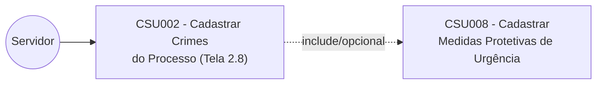
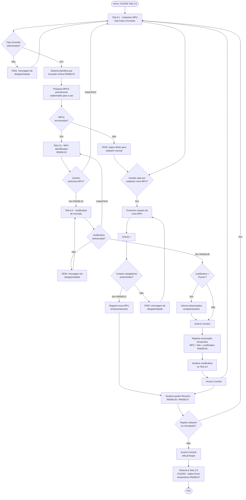
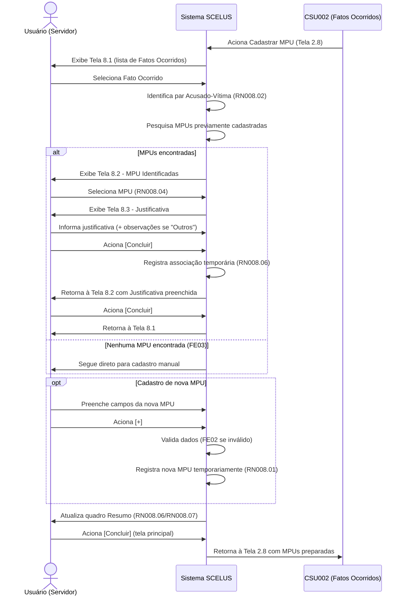
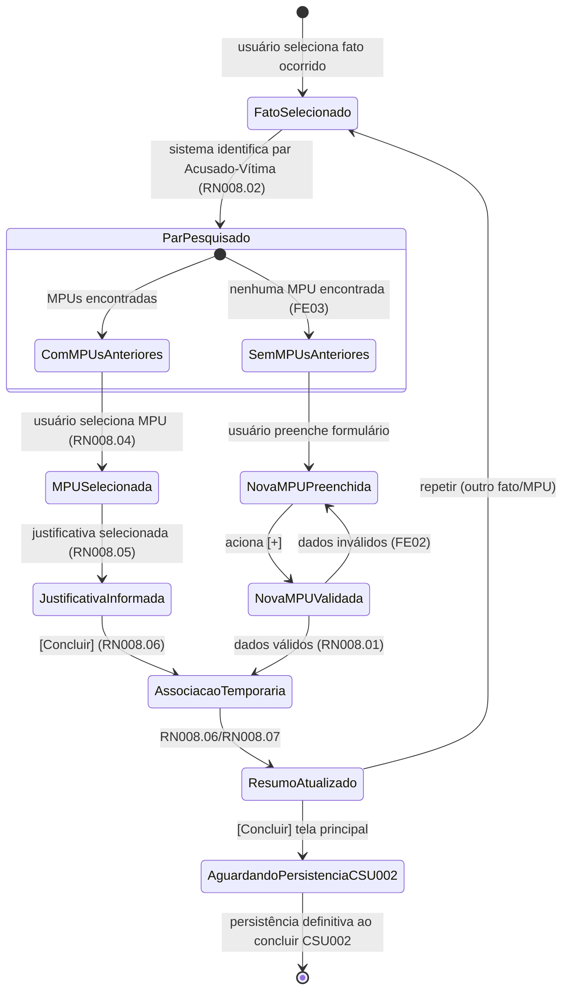

# CSU008 – Cadastrar Medidas Protetivas de Urgência (MPU)

**Sistema:** SCELUS
**Local:** São Luís
**Última atualização:** 18/03/2026 — v1.0 — Olavo Abreu

---

## 1. Descrição

Permite o cadastro de uma ou mais **Medidas Protetivas de Urgência (MPU)**, bem como a identificação, seleção e vinculação de medidas **já cadastradas** para o mesmo par acusado–vítima, quando pertinentes ao fato ocorrido em pauta.

O caso de uso é acionado a partir do cadastro de fatos ocorridos (**CSU002 – Tela 2.8**) e permite:
- incluir novas MPUs;
- associar MPUs anteriores ao fato selecionado, mediante justificativa padronizada e observações complementares.

## 2. Atores

| Ator | Responsabilidade |
|---|---|
| Servidor | Realiza o cadastro e/ou vinculação de MPUs no sistema |

## 3. Diagrama de caso de uso

> Arquivo original: `\documentos\REQ\Diagramas\Caso de uso\diagrama_casos_uso.jpg`

## 4. Pré-condições

- O processo deve estar previamente selecionado no sistema;
- Deve existir ao menos um fato ocorrido previamente cadastrado para o processo;
- O usuário deve possuir permissão para cadastrar MPU;
- O caso de uso deve ser acionado a partir do contexto do cadastro de fatos ocorridos do processo (CSU002).

## 5. Fluxo principal

1. O usuário acessa a funcionalidade a partir da Tela 2.8 (CSU002);
2. O sistema exibe a Tela **8.1 – Cadastrar MPU**, com o número do processo e a lista de fatos ocorridos do processo;
3. O usuário seleciona um fato ocorrido;
4. O sistema identifica o par acusado–vítima correspondente (**RN008.02**);
5. O sistema pesquisa MPUs previamente cadastradas para o mesmo par;
6. **Se existirem** medidas encontradas → Tela **8.2 – MPU Identificadas** (RN008.02, RN008.03);
7. O usuário seleciona uma MPU localizada (RN008.04);
8. O sistema exibe Tela **8.3 – Justificativa de Inclusão** (RN008.05);
9. O usuário seleciona a justificativa; se "outros", informa observações complementares;
10. O usuário aciona **[Concluir]** (RN008.06);
11. O sistema registra temporariamente a associação MPU ↔ fato ocorrido + justificativa/observações, e atualiza o campo Justificativa na Tela 8.2;
12. O usuário aciona **[Concluir]** e retorna à Tela 8.1;
13. O sistema atualiza o quadro **Resumo** (RN008.07);
14. **Alternativamente**, o usuário cadastra nova MPU preenchendo: MPU Número, Data da Decisão, Legislação, Foi Concedida?, Data de Intimação Acusado/Vítima, Data de Ciência Acusado/Vítima, Pedido de Desistência?, Inquérito Instaurado?, Observações;
15. O usuário aciona **[+]** (RN008.01);
16. O sistema valida os dados;
17. O sistema registra temporariamente a nova MPU e sua associação ao fato selecionado;
18. O sistema atualiza o quadro Resumo (RN008.06);
19. Os passos 5–21 podem repetir-se quantas vezes necessário;
20. Ao finalizar, o usuário aciona **[Concluir]** da tela principal;
21. O sistema retorna à Tela 2.8 (CSU002);
22. Fluxo encerrado.

### SF01 – Exibir lista de MPUs previamente cadastradas
1. Sistema identifica MPUs para o par acusado–vítima (RN008.02);
2. Exibe Tela 8.2 (RN008.03);
3. Usuário seleciona MPU para inclusão, ou retorna à tela anterior.

### SF02 – Justificar inclusão de MPU previamente cadastrada
1. Após seleção, sistema exibe Tela 8.3;
2. Usuário seleciona justificativa (RN008.05); se "outros", registra observações;
3. Usuário aciona **[Concluir]**;
4. Sistema retorna à Tela 8.2.

## 6. Fluxos alternativos

### FA01 – Retornar da tela de MPUs identificadas
**Pré-condição:** o sistema localizou ao menos uma MPU para o par acusado–vítima.
1. Usuário aciona **[Voltar]** na Tela 8.2;
2. Sistema retorna à Tela 8.1;
3. Fluxo principal retomado a partir do passo 17.

### FA02 – Retornar da tela de justificativa de inclusão
**Pré-condição:** usuário está na Tela 8.3.
1. Usuário aciona **[Voltar]**;
2. Sistema retorna à Tela 8.2;
3. Fluxo principal retomado a partir do passo 9.

## 7. Fluxos de exceção

| Código | Cenário | Comportamento do sistema | Retomada |
|---|---|---|---|
| **FE01** | Fato ocorrido não selecionado | Exibe mensagem de obrigatoriedade; não busca MPUs nem permite nova inclusão | Passo 5 |
| **FE02** | Campo obrigatório da nova MPU não preenchido | Exibe mensagem de obrigatoriedade; permanece na Tela 8.1 | Passo 17 |
| **FE03** | Nenhuma MPU previamente cadastrada localizada | Tela 8.2 não é exibida; segue direto para cadastro manual | Passo 17 |
| **FE04** | Justificativa de inclusão não selecionada | Exibe mensagem de obrigatoriedade; permanece na Tela 8.3 | Passo 11 |

### Diagrama de fluxo (visão geral — principal, subfluxos, alternativos e exceções)

### Diagrama de sequência (interação usuário/sistema)

## 8. Regras de negócio

| Código | Regra |
|---|---|
| **RN008.01** | Ao acionar **[+]**, o sistema registra temporariamente (persistência definitiva ocorre apenas ao final do CSU002): `TB_MEDIDA_PROTETIVA_URGENCIA` (int_mpu_id, int_vitima_id, int_acusado_id, str_numero_unico_originario) e `TB_FATO_OCORRIDO_MPU` (int_fato_ocorrido_mpu_id, int_fato_ocorrido_id, int_mpu_id, int_justificativa_inclusao_mpu_id). |
| **RN008.02** | Ao selecionar o fato ocorrido, o sistema identifica automaticamente o par acusado–vítima e pesquisa **todas** as MPUs previamente cadastradas para esse par, independentemente do processo ou fato ocorrido de origem. |
| **RN008.03** | A Tela 8.2 deve exibir, no mínimo: data da decisão, legislação, processo de origem, justificativa e mecanismo de seleção individual da MPU. |
| **RN008.04** | A associação de MPU previamente cadastrada **não é automática** — exige seleção explícita do usuário. |
| **RN008.05** | Toda MPU previamente cadastrada selecionada exige seleção de justificativa de inclusão (Tela 8.3). |
| **RN008.06** | O quadro Resumo exibe: novas MPUs da sessão corrente + MPUs previamente cadastradas vinculadas ao fato em pauta. |
| **RN008.07** | Nenhum dado do CSU008 é persistido definitivamente durante sua execução — a persistência ocorre apenas na conclusão do **CSU002**. |

### Diagrama de estado — ciclo de vida da MPU no contexto do CSU008

## 9. Requisitos especiais

| Código | Requisito |
|---|---|
| RE01 | Campo Processo é apenas contextual, não editável. |
| RE02 | Campo Fato Ocorrido em lista de seleção, restrito ao processo em pauta. |
| RE03 | Seleção do fato ocorrido identifica automaticamente o par acusado–vítima. |
| RE04 | Havendo MPUs para o par, exibir Tela 8.2. |
| RE05 | Seleção de MPU previamente cadastrada deve ser individual e explícita. |
| RE06 | Toda MPU previamente selecionada exige exibição da Tela 8.3. |
| RE07 | Quadro Resumo atualizado dinamicamente a cada inclusão/vinculação. |
| RE08 | Campos de data devem aceitar apenas valores válidos no formato padrão do sistema. |

## 10. Pós-condição

As MPUs novas ou previamente cadastradas selecionadas ficam preparadas para persistência posterior ao final do **CSU002**, e o usuário retorna à Tela 2.8.

## 11. Observações

O sistema Scelus deve seguir o padrão de interface e comportamento adotado nos sistemas do TJMA.

## 12. Interface de usuário

### Tela 8.1 – Cadastrar MPU

| Nome | Atributo | Restrição |
|---|---|---|
| Processo * | VW_PROCESSO.str_numero_unico | Apenas contextual (RE01) |
| Fato Ocorrido * | TB_FATO_OCORRIDO.int_fato_ocorrido_id | Lista restrita ao processo (RE02) |
| MPU Número * | TB_MEDIDA_PROTETIVA_URGENCIA.str_numero_mpu | |
| Data da Decisão * | TB_MEDIDA_PROTETIVA_URGENCIA.dta_decisao | |
| Legislação | TB_MEDIDA_PROTETIVA_URGENCIA.str_legislacao_fundamento | |
| Foi Concedida? | TB_MEDIDA_PROTETIVA_URGENCIA.bol_concedida | |
| Data de Intimação do Acusado | TB_MEDIDA_PROTETIVA_URGENCIA.dta_intimacao_acusado | |
| Data de Intimação da Vítima | TB_MEDIDA_PROTETIVA_URGENCIA.dta_intimacao_vitima | |
| Data de Ciência do Acusado | TB_MEDIDA_PROTETIVA_URGENCIA.dta_ciencia_acusado | |
| Data de Ciência da Vítima | TB_MEDIDA_PROTETIVA_URGENCIA.dta_ciencia_vitima | |
| Há pedido de desistência? | TB_MEDIDA_PROTETIVA_URGENCIA.bol_pedido_desistencia | |
| Há inquérito instaurado? | TB_MEDIDA_PROTETIVA_URGENCIA.bol_inquerito_instaurado | |
| Observações | TB_MEDIDA_PROTETIVA_URGENCIA.str_observacoes | |

### Tela 8.2 – MPU Identificadas

| Nome | Atributo | Restrição |
|---|---|---|
| Data da Decisão * | TB_MEDIDA_PROTETIVA_URGENCIA.dta_decisao | |
| Legislação * | TB_MEDIDA_PROTETIVA_URGENCIA.str_legislacao_fundamento | |
| Processo * | VW_PROCESSO.str_numero_unico | |
| Justificativa | TB_JUSTIFICATIVA_INCLUSAO_MPU.str_justificativa_inclusao | Preenchida dinamicamente ao retornar da Tela 8.3 |

### Tela 8.3 – Justificativa de Inclusão de MPU

| Nome | Atributo |
|---|---|
| Justificativa * | TB_JUSTIFICATIVA_INCLUSAO_MPU.str_justificativa_inclusao |
| Observações * | TB_FATO_OCORRIDO_MPU.str_observacao |

**Observação de UI:** os campos devem ser bloqueados para digitação ao atingir a capacidade máxima definida no tamanho do campo.

## 13. Diagrama de atividade

Não se aplica (documento original) — ver diagrama de fluxo na seção 5.

## 14. Diagrama de estado

Não se aplica (documento original) — ver diagrama de estado na seção 8.

## 15. Diagrama entidade-relacionamento (DER)

> `\documentos\REQ\Diagramas\DER`

---

## ⚠️ Pontos de atenção para o desenvolvimento

1. **Persistência diferida (RN008.07):** todo o cadastro do CSU008 é temporário e só é gravado no banco quando o **CSU002** é concluído — isso implica manter estado compartilhado entre os dois casos de uso (mesma sessão/contexto transacional).
2. **RN008.02** determina busca de MPUs **globais** para o par acusado–vítima (não restrita ao processo/fato atual) — atenção ao desempenho da consulta e à necessidade de exibir o "processo de origem" (RN008.03) para diferenciar a procedência de cada MPU encontrada.
3. Os campos obrigatórios (*) na Tela 8.1 aparentam inconsistência: "Legislação", "Foi Concedida?" e as datas de intimação/ciência não têm `*`, mas são citados no fluxo (passo 14) como parte do cadastro completo — validar com o time de negócio quais campos são realmente obrigatórios.
4. **FE03** é um "não evento" (a Tela 8.2 simplesmente não aparece) — importante tratar como fluxo normal de UI (sem mensagem de erro), diferente de FE01/FE02/FE04 que exibem mensagens.
5. O texto menciona "passos 5 a 21" como o intervalo repetível (passo 19) — confirmar a numeração exata ao transformar em user stories/casos de teste, pois a lista deste documento foi renumerada de 1 a 22 para clareza.
