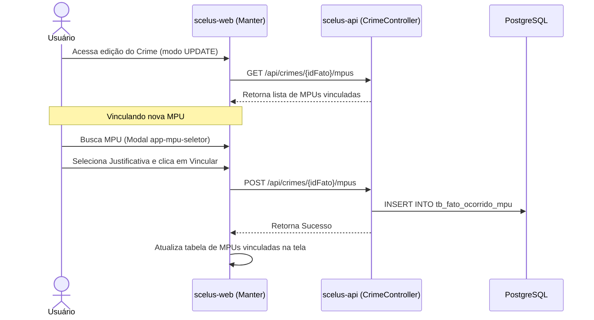

# Guia de Teste de Vínculo de MPU (CSU008) ao Fato Ocorrido

Este documento descreve o fluxo de integração e as rotas para testar o vínculo de Medidas Protetivas de Urgência (MPU) a um Fato Ocorrido (CSU002/CSU008).

---

## 1. Contexto Arquitetural

O vínculo de Medidas Protetivas não ocorre direto na entidade de conduta/crime, mas sim sobre a ocorrência principal, a tabela **Fato Ocorrido**.
* **Tabela de associação:** `tb_fato_ocorrido_mpu`
* **Campos principais:** `id`, `fato_ocorrido_id`, `mpu_id`, `justificativa_inclusao_mpu_id`, `observacao_justificativa`

---

## 2. Fluxo de Execução no Sistema



---

## 3. Roteiro de Teste Manual (Interface)

1. Acesse a listagem de crimes e clique em **Editar** (`/crimes/edit/{id}`) em qualquer registro ativo.
2. Role a página até a seção **Medidas Protetivas de Urgência Vinculadas**.
3. No campo de busca de MPU, clique na lupa ou digite o número para abrir o modal de pesquisa.
4. Selecione uma MPU fictícia retornada da lista.
5. Selecione um motivo no campo **Justificativa de Inclusão** (obrigatório).
6. Clique em **Adicionar Vínculo**.
7. Verifique se a MPU aparece imediatamente na tabela de vinculados e a mensagem de sucesso é mostrada.
8. Teste a exclusão clicando no botão de **Lixeira** na linha da tabela de vínculo de MPU e confirme a exclusão.

---

## 4. Testes de API (HTTP)

Você pode rodar os testes abaixo usando a extensão **REST Client** (arquivo `.http`) no VS Code para verificar o comportamento das rotas no backend:

```http
### Configurações de Variáveis
@baseUrl = http://localhost:8080
@idFatoOcorrido = 1

### 1. Listar MPUs vinculadas a um Fato Ocorrido
GET {{baseUrl}}/api/crimes/{{idFatoOcorrido}}/mpus
Content-Type: application/json

### 2. Vincular uma MPU ao Fato (CSU008)
POST {{baseUrl}}/api/crimes/{{idFatoOcorrido}}/mpus
Content-Type: application/json

{
  "idMpu": 101,
  "idJustificativaInclusaoMpu": 1,
  "observacaoJustificativa": "Vínculo de teste manual para validação do CSU008"
}

### 3. Deletar Vínculo de MPU do Fato
# Substitua o '999' pelo ID do vínculo retornado no GET/POST
DELETE {{baseUrl}}/api/crimes/{{idFatoOcorrido}}/mpus/999
Content-Type: application/json
```
